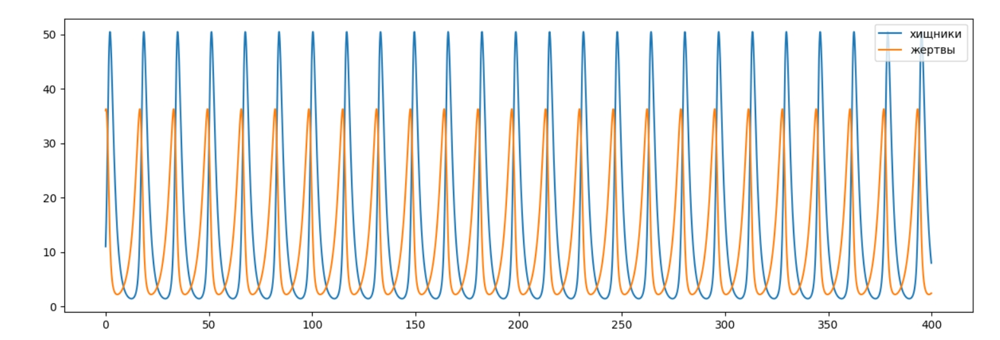

## Прагматика выполнения лабораторной работы(Зачем)
Такие уравнения можно использовать для моделирования систем «хищник - жертва», «паразит - хозяин», конкуренции и других видов взаимодействия между двумя видами.  

## Цель работы
Рассмотреть простейшую модель взаимодействия двух видов типа «хищник — жертва» - моделью Лотки-Вольтерры и ее построение с помощью языка программирования Python.

## Задачи
Для модели "хищник-жертвва":

$$
\begin{cases}
    \frac{\partial x}{\partial t} = -0.57x(t)+0.047x(t)y(t)
    \\
    \frac{\partial y}{\partial t} = 0.37y(t)-0.027x(t)y(t)
\end{cases}
$$

1. Построить график зависимости численности хищников от численности жертв,а также графики изменения численности хищников и численности жертв при 
следующих начальных условиях: $x_0 = 11, y_0 = 36$

2. Найдите стационарное состояние системы.

## Результат
В данной лабораторной работе ознакомилась с простейшей моделью взаимодействия двух видов типа «хищник — жертва», построив для нее графики изменения численностей взависимости от времени, график зависимости численности от жертв и найдя стационарное состояние данной системы.

(рис. fig:001)

{ #fig:001 width=70% }

(рис. fig:002)

{ #fig:002 width=70% }

Стационарное состояние системы будет в точке:

$$ x_0 = \frac{b}{d} = \frac{0.37}{0.027} \approx 13.70 $$ $$ y_0 = \frac{a}{c} = \frac{0.57}{0.047} \approx 12.13 $$

