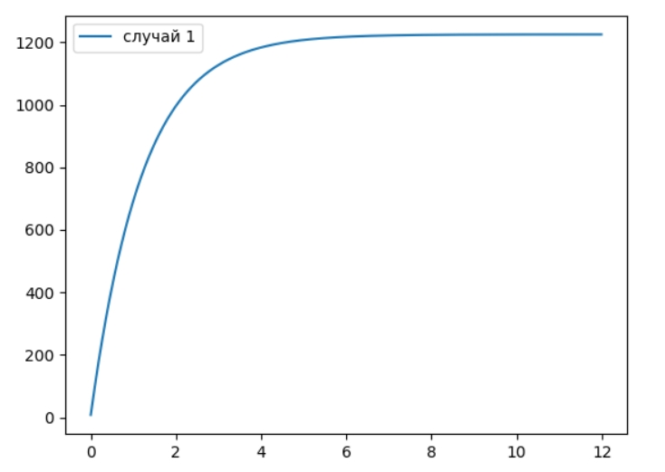
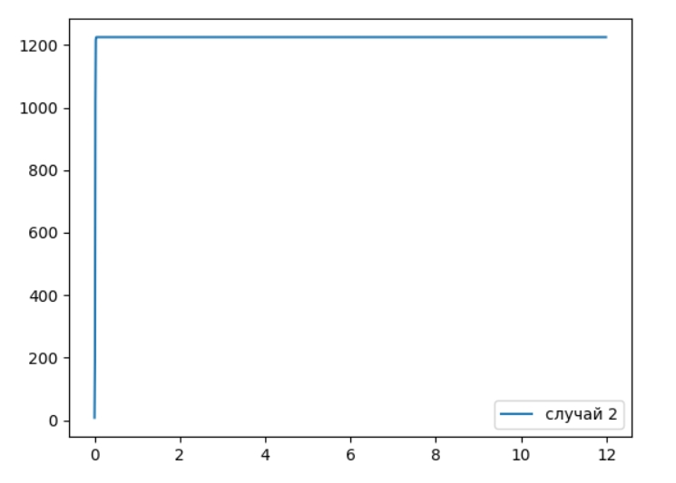
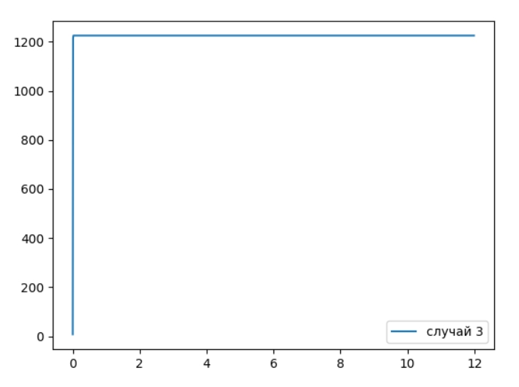

## Прагматика выполнения лабораторной работы(Зачем)

Понимание принципов построения модели Мальтуса и модели логистической кривой помогают в определении эффективности рекламы.

## Цель работы

Рассмотреть модель распространения рекламы.

## Задачи

1. Построить график распространения рекламы, математическая модель которой описывается следующим уравнением: $\frac{dn}{dt} = (0.815+0.000033n(t))(N-n(t))$

2. Построить график распространения рекламы, математическая модель которой описывается следующим уравнением: $\frac{dn}{dt} = (0.000044+0.27n(t))(N-n(t))$ Для этого случая определить, в какой момент времени скорость распространения рекламы будет иметь максимальное значение.

3. Построить график распространения рекламы, математическая модель которой описывается следующим уравнением: $\frac{dn}{dt} = (0.5*t+0.8*cos(t)n(t))(N-n(t))$

## Результат
Ознакомилася с моделью Мальтуса и моделью логистической кривой на примере эффективности рекламы. Построила соответствующие графики для трех случаев.

(рис. -@fig:001)

{ #fig:001 width=70% }

(рис. -@fig:002)

{ #fig:002 width=70% }

(рис. -@fig:003)

{ #fig:003 width=70% }

